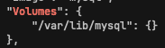
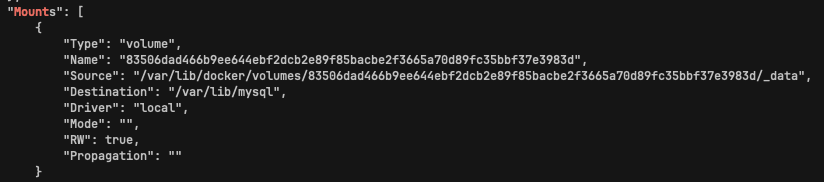
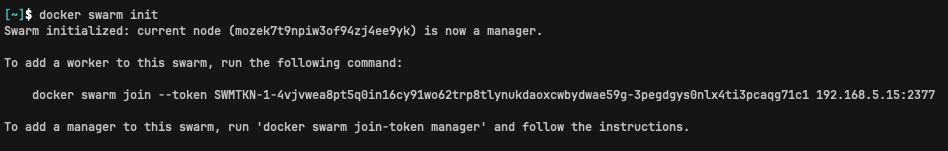
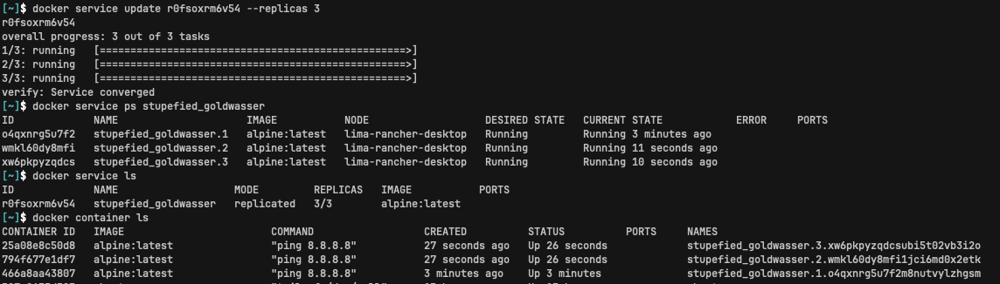
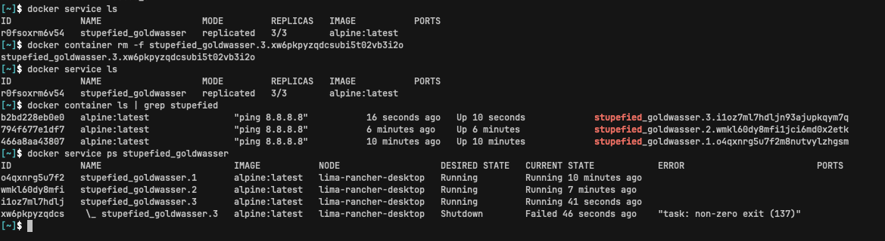
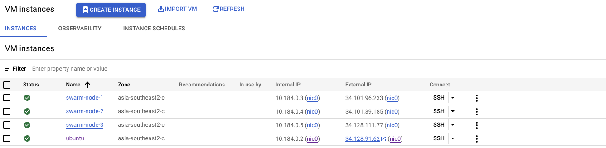
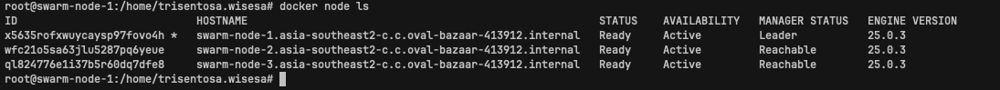
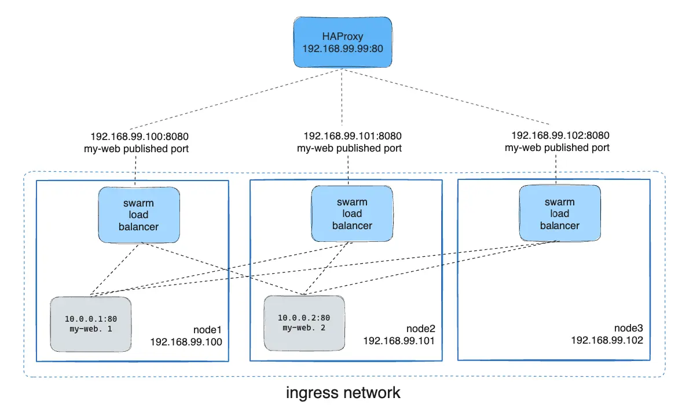

<div align="center">
  <h1>Docker Mastery </h1>
</div>

<h1>Table of Contents</h1>

- [Course](#course)
- [Handbook](#handbook)
  - [Intro](#intro)
    - [Three Innovations](#three-innovations)
    - [Quick Container Run](#quick-container-run)
  - [Setup Docker for your OS](#setup-docker-for-your-os)
    - [Installing the Right Docker for this course](#installing-the-right-docker-for-this-course)
    - [Windows Setup](#windows-setup)
    - [Mac Setup](#mac-setup)
    - [Linux Setup](#linux-setup)
    - [VSCode Setup](#vscode-setup)
  - [Creating and Using Containers](#creating-and-using-containers)
    - [Check Docker Install and Config](#check-docker-install-and-config)
    - [Starting a Nginx Web Server](#starting-a-nginx-web-server)
    - [Debrief: What Happens When We Run a Container](#debrief-what-happens-when-we-run-a-container)
    - [Container vs VM: It's just a Process](#container-vs-vm-its-just-a-process)
    - [Docker Internals](#docker-internals)
    - [Assignment: Manage Multiple Containers](#assignment-manage-multiple-containers)
    - [What's Going On in Containers: CLI Process Monitoring](#whats-going-on-in-containers-cli-process-monitoring)
    - [Use MariaDB rather than MySQL](#use-mariadb-rather-than-mysql)
    - [Getting a Shell Inside Containers: No Need for SSH](#getting-a-shell-inside-containers-no-need-for-ssh)
    - [Docker Networks: Concepts for Private and Public Comms in Containers](#docker-networks-concepts-for-private-and-public-comms-in-containers)
    - [Docker Networks: CLI Management of Virtual Networks](#docker-networks-cli-management-of-virtual-networks)
    - [Docker Networks: DNS and How Containers Find Each Other](#docker-networks-dns-and-how-containers-find-each-other)
    - [Assignment: Using Containers for CLI Testing](#assignment-using-containers-for-cli-testing)
    - [Assignment: DNS Round Robin Test](#assignment-dns-round-robin-test)
  - [Container Images, Where to Find Them and How to Build Them](#container-images-where-to-find-them-and-how-to-build-them)
    - [What's in an Image (and What's isn't)](#whats-in-an-image-and-whats-isnt)
    - [Using Docker Hub Registry Images](#using-docker-hub-registry-images)
    - [Images and their Layers: Discover the Image Cache:](#images-and-their-layers-discover-the-image-cache)
    - [Image Tagging and Pushing to Docker Hub](#image-tagging-and-pushing-to-docker-hub)
    - [Building Images: The Dockerfile Basics](#building-images-the-dockerfile-basics)
    - [Building Images: Running Docker Builds](#building-images-running-docker-builds)
    - [Building Images: Extending Official Images](#building-images-extending-official-images)
    - [Assignment: Build your Own Dockerfile and Run Containers From it](#assignment-build-your-own-dockerfile-and-run-containers-from-it)
    - [Using Prune to Keep Your Docker System Clean](#using-prune-to-keep-your-docker-system-clean)
  - [Persistent Data: Volumes](#persistent-data-volumes)
    - [Container Lifetime \& Persistent Data](#container-lifetime--persistent-data)
    - [Persistent Data: Data Volumes](#persistent-data-data-volumes)
    - [Persistent Data: Bind Mounting](#persistent-data-bind-mounting)
    - [Database Passwords in Containers](#database-passwords-in-containers)
    - [Assignment: Database Upgrades with Named Volumes](#assignment-database-upgrades-with-named-volumes)
    - [Assignment: Edit Code Running in Containers with Bind Mounts](#assignment-edit-code-running-in-containers-with-bind-mounts)
  - [Making it Easier with Docker Compose: The Multi-Container Tool](#making-it-easier-with-docker-compose-the-multi-container-tool)
    - [Docker Compose and The `docker-compose.yml` file](#docker-compose-and-the-docker-composeyml-file)
    - [Compose V2](#compose-v2)
    - [Trying Out Basic Compose Commands](#trying-out-basic-compose-commands)
    - [Assignment: Compose-Assignment-1](#assignment-compose-assignment-1)
    - [Adding Image Building to Compose Files](#adding-image-building-to-compose-files)
    - [Assignment: Compose-Assignment-2](#assignment-compose-assignment-2)
  - [Swarm Intro](#swarm-intro)
    - [Swarm mode: Built-in orchestration](#swarm-mode-built-in-orchestration)
    - [Create your First Service and Scale it Locally](#create-your-first-service-and-scale-it-locally)
    - [Creating a 3-Node Swarm Cluster](#creating-a-3-node-swarm-cluster)
  - [Swarm Basic Features and How to use](#swarm-basic-features-and-how-to-use)
    - [Section Requirements:](#section-requirements)
    - [Scaling Out with Overlay Networking](#scaling-out-with-overlay-networking)
    - [Scaling Out with Routing Mesh](#scaling-out-with-routing-mesh)
    - [Assignment: Create a Multi-Service Multi-Node Web App](#assignment-create-a-multi-service-multi-node-web-app)
    - [Swarm Stacks and Production Grade Compose](#swarm-stacks-and-production-grade-compose)
    - [Secrets Storage for Swarm: Protecting your Environemtn Variables](#secrets-storage-for-swarm-protecting-your-environemtn-variables)
    - [Using Secrets in Swarm Services](#using-secrets-in-swarm-services)
    - [Using Secrets with Swarm Stacks](#using-secrets-with-swarm-stacks)
    - [Assignments:](#assignments)
  - [Swarm App Lifecycle](#swarm-app-lifecycle)
  - [Container Registires: Image Storage and Distribution](#container-registires-image-storage-and-distribution)
  - [Docker in Production](#docker-in-production)

# Course
- https://www.udemy.com/course/docker-mastery
- https://github.com/BretFisher/udemy-docker-mastery/tree/main

# Handbook

## Intro

### Three Innovations

"Docker Build Ship Run"
- Docker Image
  - Universal app packaging (can run anywhere)
  - `Dockerfile`: instruction to make docker/cotainer image (`OCI` image standard)
  - `docker build`: to build an image from a `Dockerfile`
- Docker Registry: application distribution
  - `OCI` distribution spec: standard on how to distribute containers around (`dockerhub`, `bitbucket`, `github`, etc)
  - 
- Docker Container
  - `docker run <app>`: run and instantiate the container from an image
  - `namespace`: where the container is located in.It limits what the container can see (only its own filesystem). Each container get its own IP address, process list, basically its own system inside it.
  - In image below, both server are identical. The `Docker` represents `Docker Engine` which manages the docker "build ship run" flow in your system. Container 1 and Container 2 are built on top of the same image, but are its own namespace, meaning they are isolated with each other. 
  - 
- Extra:
  - About OCI: https://opencontainers.org/about/overview/
  - K8s vs Docker: https://www.bretfisher.com/kubernetes-vs-docker/

### Quick Container Run
- Quick Start: https://labs.play-with-docker.com/
  - Do `+ADD NEW INSTANCE`
  - ```bash
    docker run -d -p 8800:80 httpd # -d: run in background; -p: map host port:container port
    curl localhost:8800 
    docker run -d -p 8801:80 httpd #remake as long as different public port
    docker ps
    ```

## Setup Docker for your OS

### Installing the Right Docker for this course
- [Docker Desktop](https://docs.docker.com/desktop/): bundle of tools typically used in docker development (not open source, but free for learning), should be installed in your local setup, not in servers.
  - With docker, the image you run must match with the kernel that was designed for it
  - Most containers run in linux kernel. So in `Docker Destop` or similar tools, it will create a tiny VM do versioning, installing tools, etc for your local docker use.
- Docker Engine: included in `Docker Desktop`, use this when you are running containers in servers
  
### Windows Setup
https://docs.docker.com/desktop/install/windows-install/

### Mac Setup
https://docs.docker.com/desktop/install/mac-install/

### Linux Setup
https://docs.docker.com/desktop/install/linux-install/

### VSCode Setup
- Extensions Installed:
  - Docker (Microsoft)
  - Kubernetes (Microsoft)
  - Remote-Development (Microsoft). will contains:
    - Remote Containers
    - Remote SSH
    - Remote WSL

## Creating and Using Containers 

### Check Docker Install and Config
```bash
docker version # Check docker client's version and server(engine/daemon) version
docker info # more detailed information about our docker (config and values)
docker # list of commands (common, management, swarm, commands)
```

Docker Command Format:
- "management commands" format: `docker <command> <sub-command> (options)`
  - e.g. `docker container run`
- old way: `docker <command> <options>`
  - e.g. `docker run`

### Starting a Nginx Web Server
- Image vs Container
  - image: application we want to run
  - container: an instance of that image running as a process
  - docker default image registry: [Docker Hub](hub.docker.com)
- run/stop/remove containers
```bash
docker container run --publish 8888:80 nginx
# download image 'nginx' from Docker Hub
# started a new container from that image
# opened port 8888 on the host IP (--publish)
# routes that traffic to the container IP, port 80 (--publish)

docker container run -d --publish 8888:80 nginx # -d or --detach
# exit first process and run this one, detach makes docker to run in the background
# will return container id in the console (unique for each container)
# e.g. 638a56ccfcad9e75061934c3abd2d0105af7a4a09c5b0ff907f8e6ea532769f7

docker container ls # list all containers 
# -a or --all : shows all containers (default is just showing running containers)

docker container stop 638a5 # stop container by its id or name
# container id doesn't have to be full, just first few digits for it to be unique (e.g. docker stop 638a5)\

docker container run -d --publish 8888:80 --name webhost nginx # --name: add name
docker container logs webhost # show logs of a container by id or name
docker container top webhost # process running inside this container
docker container rm webhost # remove by id or name | -f to force remove 
```
- check container logs and processes

### Debrief: What Happens When We Run a Container
- What happens in `docker container run`?
  - looks for that image locall in image cache, doesn't find anything (since we never install nginx image)
  - then looks in remote image repository (defaults: `Docker Hub`)
  - Downloads the lates version (`nginx:latest` by default)
  - Creates a new container based on that image and prepares to start
  - Gives it a virtual IP on a private network inside docker engine
  - Opens up port 8888 on host and forwards to port 80 in container
  - Starts container by using the CMD in the image Dockerfile

### Container vs VM: It's just a Process
- 
- Containers are just processes, meaning that all the processes run for the container, is visible on your host as well
- Since I'm using mac, need to access docker VM: https://www.bretfisher.com/docker-for-mac-commands-for-getting-into-local-docker-vm/ 
```bash
docker run --name mongo -d mongo

docker run -it --rm --privileged --pid=host justincormack/nsenter1 # enter the linux VM in mac
ps aux | grep "mongo" # you will see mongod running as a process in host (of this VM lol)
```
- Resources: https://github.com/mikegcoleman/docker101/blob/master/Docker_eBook_Jan_2017.pdf

### Docker Internals
- https://www.youtube.com/watch?v=sK5i-N34im8&list=PLBmVKD7o3L8v7Kl_XXh3KaJl9Qw2lyuFl

### Assignment: Manage Multiple Containers
- utilize [docks.docker.com](docks.docker.com) and `--help`
- Run an `nginx`, `mysql`, and `httpd`(apache) server
- Run all of them with `-d` and `--name`
- `nginx` listen in port 80:80, `httpd` on 8080:80, `mysql` on 3306:3306
- for `mysql`, use `--env` to pass in `MYSQL_RANDOM_ROOT_PASSWORD=yes`
- use `docker container logs` on mysql to find the random passowrd it created on startup
- Clean it all up with `docker container stop` and `docker container rm`

```bash
docker container run -d --name nginx --publish 8081:80 nginx
docker container run -d --name httpd --publish 8080:80 httpd
docker container run -d --name mysql --publish 3306:3306 --env MYSQL_RANDOM_ROOT_PASSWORD=yes mysql
docker ps -a
docker container logs mysql
docker container stop mysql nginx httpd
docker container rm mysql nginx httpd
```

### What's Going On in Containers: CLI Process Monitoring
```bash
docker container top # process list in one container
docker container inspect # details of one container config
docker container stats # live update on performance stats for all containers 
```

Some output snippets:
- `inspect`:

- `stats`:


### Use MariaDB rather than MySQL
- official MySQL image has now removed commands like ps and apt-get.
- use `mariadb` image should be fine

### Getting a Shell Inside Containers: No Need for SSH
- Commands:
  - `docker container run -it`: start new container interactively
    - note that container is only running when terminal is active
    - `-t`: pseudo-tty; simulates a real terminal, like what SSH does
    - `-i`: keep session open to receive terminal inputs
    - Argument: 
      - `bash`: if run with `-it`, will give you a terminal inside the running container
  - `docker container exec -it`: run additional command in existing container
- Different Linux Distros in Containers
  - `Alpine`: very small, security-focused linux distribution
    - has its own package manager called `apk`
- No need for SSH: has commands that can get a shell inside the container itself, no need SSH server inside container
  
```bash
docker container run -it --name proxy nginx bash
exit
docker container ls -a # can see that the container also stopped
docker container start -ai proxy # re-run container and re-open terminal

docker container run -d --name mysql --publish 3306:3306 --env MYSQL_RANDOM_ROOT_PASSWORD=yes mysql
docker container exec -it mysql bash # open bash in running container
exit # will not terminate the process

docker pull alpine
docker image ls # list downloaded images, alpine for a linux distro only 7MB 
docker container run -it alpine bash #fail, alpine doesn't have builtin bash
docker container run -it alpine sh # can open terminal using sh shell
```


 
### Docker Networks: Concepts for Private and Public Comms in Containers
- Docker Network Defaults
  - each container by default connected to a private virtual network "bridge"
  - each virtual network routes through NAT firewall on host IP
  - all containers on a virtual network can talk to each other without `-p`
  - Best practice is to create a nw virtual network for each app:
    - network `my_web_app` for mysql and php containers
    - network `my_api` for mongo and nodejs containers
  - Defaults work well in many cases, but easy to swap out parts to customise it:
    - Make new virtual netowrks
    - Attach containers to more than one virtual network (or noen)
    - Skip virtual networks and use host IP (--net=host)
    - Use different Docker network drivers to gain new abilities
    - and more...
  
```bash
docker container run -p 8888:80 --name webhost -d nginx
docker container port webhost
docker container inspect --format '{{ .NetworkSettings.IPAddress }}' webhost # check IP address of container
# --format is used to get config of your container (can also use grep, but format gives cleaner output)
```
- `--format`: https://docs.docker.com/config/formatting/


### Docker Networks: CLI Management of Virtual Networks
- Commands:
  - `docker network ls`: show networs
  - `docker network inspect`: insepct a network
  - `docker network create --diver`: create a network
  - `docker network connect`: attach a network to container
  - `docker network disconnect`: detach a network from a container

- `docker network ls` driver defaults:
  - `bridge`: default docker virtual entwork, which is NAT'ed behind the Host IP
  - `host`: gains performance by skipping virtual networks but sacrifices security of container model
  - `none`: not connected to network

```bash
docker network ls
docker network inspect bridge

docker network create my_app_network 
docker container run -d --name nginx_2 --network my_app_network nginx
docker network inspect my_app_network
docker network connect my_app_network webhost
docker container inspect webhost # on 2 network now 
docker network disconnect my_app_network webhost
```
- example of connected network of our `webhost`


### Docker Networks: DNS and How Containers Find Each Other

- Forget IP's: 
  - static IP's and using IP's for talking to containers is anti-pattern! best to avoid it when possible
  - can't assume that the IP address of a service will be the same even by each minute

- Docker DNS:
  - Docker daemon has a built-in DNS server that containers use by default
  - DNS Review: 
    - https://www.oracle.com/cloud/networking/dns/
    - https://howdns.works/

```bash
docker container run -d --name new_webhost --network my_app_network nginx:alpine
docker container run -d --name new_nginx --network my_app_network nginx:alpine
docker container exec -it new_webhost ping new_nginx # test network in the virtual network
```

### Assignment: Using Containers for CLI Testing
- Assingment:
  - Use different linux distro containers to check `curl` cli tool version
  - Use two different terminal windows to start bash in both `centos:7` and `ubuntu:14.04` using `-it`
  - Learn `docker container --rm` option so you can save cleanup (https://mkyong.com/docker/what-is-docker-rm-option/)
  - Ensure `curl` installed and on latest version for that distro
    - ubuntu: `apt-get update && apt-get install curl`
    - centos: `yum update curl`
  - Check `curl --version`
- Answer:
```bash
docker container run --rm -it centos:7
```
```bash
#centos shell
yum update curl
curl --version # curl 7.29.0 (x86_64-redhat-linux-gnu)
```
```bash
docker container run --rm -it ubuntu:14.04
```
```bash
#ubuntu shell
apt-get update && apt-get install curl
curl --version # curl 7.35.0 (x86_64-pc-linux-gnu)
```

### Assignment: DNS Round Robin Test
- Assignment:
  - Since Docker Engine 1.11, we can have multiple containers on a created network respond to the same DNS address
  - Create a new virtual network (default brdige driver)
  - Create two containers from `elasticsearch:2` image
  - Research and use `--network-alias search` when creating them to give them an additional DNS name to respond to
    - https://docs.docker.com/engine/reference/commandline/network_connect/#alias
  - Run `alpine nslookup search` with `--net` to see the two containers list for the same DNS name
  - Run `alpine curl -s search:9200` with `--net` multiple times until you see both "name" fields show 
- Answer:
```bash
docker pull elasticsearch:2
docker network create dns_net
docker container run -d --rm --name elastic_1 elasticsearch:2 \
&& docker container run -d --rm --name elastic_2 elasticsearch:2
docker network connect --alias search dns_net elastic_1
docker network connect --alias search dns_net elastic_2

#add alpine container for testing
docker container run -d --rm --name alpine_dns alpine
docker network connect dns_net alpine_dns

nslookup search
curl -s search:9200
curl -s search:9200
curl -s search:9200
```
- `nslookup` output


- `curl` output


## Container Images, Where to Find Them and How to Build Them

### What's in an Image (and What's isn't)
- Image
  - What is: 
    - App binaries and dependencies
    - Metadata about the image data and how to run the image
    - can be as small as one file 
    - Big as a Ubuntu distro with apt, apache, php installed
  - What isn't:
    - Not a complete OS. NO kernel, kernel modules (e.g. drivers), since it will run on host OS

### Using Docker Hub Registry Images
- [Docker Hub](https://hub.docker.com)
  - if official image, it will not have forward slash in its name
  - e.g. just `nginx` -> https://hub.docker.com/_/nginx (not `account_name/nginx`)
- Versioning:
  - Using tags, usually can refer to "Supported tags" section
  
  - multiple tags can refer to same image, same `Image ID` (e.g `1.25.3, mainline, 1, 1.25, latest, 1.25.3-bookworm, mainline-bookworm, 1-bookworm, 1.25-bookworm, bookworm`)
  - for offical images, by default tag is `latest`
  - in production, best to use by specific tags e.g. `11.1.9`
  - ones like "1.25.3-perl" or "1.25.3-alpine" means that they are built on top of base perl image or alpine image
- Official docker images: https://github.com/docker-library/official-images/tree/master/library or use "Explore" section in `Docker Hub`

### Images and their Layers: Discover the Image Cache:
- Union File Systems (UFS):
  - When pulling, you realize that there are multi-step process in pulling image
  - 
  - its because of Union file system, which is images work by making layer of the changes
  - each layer is unique, identified by its id in SHA format. Stored only onece on a host
  - this series of changes are defined in the `Dockerfile`
  - For the example above, we already have some "Already exists" and "Pull Complete"
    - "Already exists": meaning that we have that layer in cache (maybe other image in our system use the same layer already)
    - "Pull complete": get layer we don't have yet
  - This ensures maximum efficiency of storage and transfer time
  - A container is just a single read/write layer on top of an image
- Commands:
  - `history`: get layer of changes of an image
    - e.g. `docker history nginx:latest`
    - 
  - `inspect`
    - e.g. `docker image inspect nginx`
- Resource: https://docs.docker.com/storage/storagedriver/

### Image Tagging and Pushing to Docker Hub
- Commands
  - `tag`: assign one or more tags to an image
- Image tag
  - 3 things: user, repo, tag
  - format: `<user>/<repo>:<tag>`
  - e.g. `tri/nginx:15.0.1`
  - official format: `<repo>:<tag>`
- Tag is just a pointer, snippet of `docker image ls`:
  - the image id for tag for `alpine` and `1.25.3-alpine` is the same. We're just storing one copy of this image.
  - 

```bash
docker image tag nginx trisentosawisesa/nginx # need to be your docker username
docker image ls # shows our image
docker image push trisentosawisesa/nginx # if request denied, need to login
docker login
docker image push trisentosawisesa/nginx

docker image tag trisentosawisesa/nginx trisentosawisesa/nginx:testing # new tagging
docker image push trisentosawisesa/nginx:testing # push new tag, don't need to reupload (cached)
```
result: https://hub.docker.com/repository/docker/trisentosawisesa/nginx/general

### Building Images: The Dockerfile Basics
- `Dockerfile`: recipe for creating an image
  - in docker cli, sometimes can use `-f` to refer something than the default `Dockerfile`
  - e.g. `docker build -f my-dockerfile`
  - Examples in course repo:
    - [sample 1](../dockerfile-sample-1/)
    - [sample 2](../dockerfile-sample-2/)
    - [sample 3](../dockerfile-sample-3/)
    - [sample 4](../dockerfile-sample-4/)
    - [sample 5](../dockerfile-sample-5/)
  - Some basics instructions:
    - `FROM`: the base image to pull from
    - `ENV`: environment variables 
    - `RUN`: run commands to building your image
    - `EXPOSE`: expose container ports so it is able to be used
    - `CMD`: command to run each time a container is launched or restarted
    - `WORKDIR`: change directory (like `cd` honestly, but more descriptive and readable)
  - Dockerfile references: https://docs.docker.com/engine/reference/builder/

### Building Images: Running Docker Builds
```bash
cd dockerfile-sample-1
docker image build -t customnginx . # since use locally, tag doesnt have to use your docker ID
# . argument just to build image from dockerfile in current directory
docker image ls
```

- Tips:
  - Put lines that will have more changes over time at the bottom of the dockerfile, vice versa
  - The reason is, once a line (step) change, every other step after that will also need to be re-run
  - for example if you have command to copy your source file that change a lot, better to keep it at the bottom of dockerfile


### Building Images: Extending Official Images
```dockerfile
# dockerfile-sample-2
FROM nginx:latest

WORKDIR /usr/share/nginx/html

COPY index.html index.html
```

```bash
cd dockerfile-sample-1
docker image build -t nginx-with-html .

# test it, go to localhost:8083/index.html
docker container run -d --rm --name new_nginx_html -p 8083:80 nginx-with-html
```

### Assignment: Build your Own Dockerfile and Run Containers From it
- Assignment:
  - Take existing node.js app and dockerize it
  - Make `Dockerfile`, build it, test it, push it, rm it, run it
  - Expect this to be iterative
  - details in [dockerfile-assignment-1](../dockerfile-assignment-1/README.md)
  - use Alpine version of the official `node` 6.x image
  - Result is web site at 
  - Tag and push to your Docker Hub accountr
  - Remove your image from local cache, run again from Hub
- Answer:
  - my [dockerfile](../dockerfile-assignment-1/Dockerfile)
  ```bash
  docker image build -t trisentosawisesa/dockerfile-assignment-1 .

  docker container run -d --name node-app -p 6969:3000 trisentosawisesa/dockerfile-assignment-1

  docker stop node-app && docker rm node-app

  docker image push trisentosawisesa/dockerfile-assignment-1
  docker image rm trisentosawisesa/dockerfile-assignment-1
  docker pull trisentosawisesa/dockerfile-assignment-1

  docker container run -d --name node-app -p 6969:3000 trisentosawisesa/dockerfile-assignment-1

  ```

### Using Prune to Keep Your Docker System Clean
- Youtube video: https://youtu.be/_4QzP7uwtvI
- `docker image prune` to clean up just "dangling" images
- `docker system prune` will clean up everything you're not currently using
- `docker image prune -a` remove all images you're not using
- `docker system df` see space usage

## Persistent Data: Volumes

### Container Lifetime & Persistent Data
- Problem of persistent data:
  - containers are **usually** immutable and ephemeral
  - "immutable infrastructure": only re-deploy containers, never change
  - What about databases, or unique data? 
    - shouldn't contain unique data contain with application binaries
    - also called "separation of concerns"
  - This is known as "persistent data"
  - 2 ways: `Volumes` and  `Bind Mounts`
    - Volumes: make special location outside of container UFS
    - Bind Mounts: link container path to host path

### Persistent Data: Data Volumes
- First, a tip is to look for `Dockerfile` from official images for best practice
- This lecture, take a look at [mysql](https://github.com/docker-library/mysql/blob/ffa6423ca24168e4d96631b5e8f536ac826d2a5b/innovation/Dockerfile.oracle)
- Most databases Dockerfile likely use `VOLUME`, can be seen above in this line:
  - `VOLUME /var/lib/mysql`
- What this means, is that it tells Docker Daemon to create `Volume` location at this directory 
- `Volume` will outlive container and require manual removal to cleanup
- To check how it works:
  - ```bash
    docker container run -d --name mysql --publish 3306:3306 --env MYSQL_RANDOM_ROOT_PASSWORD=yes mysql # run mysql container

    docker inspect mysql # look for Volumes and Mount directives
    docker volume ls
    docker volume inspect 8350 # volume id

    docker stop mysql 
    docker volume ls #volume is still there
    ```
  - Volume directive
    - 
  - Mount directive
    - 
  - basically it will mount the volume directory in host directory
- `named volumes`: name your volume, easier to reuse and share between containers (`-v` option)
  ```bash
  docker container run -d --name new_mysql --publish 3306:3306 --env MYSQL_RANDOM_ROOT_PASSWORD=yes -v mysql-db:/var/lib/mysql mysql # run mysql container

  docker volume ls
  docker inspect new_mysql

  docker container run -d --name new_mysql2 --publish 3306:3306 --env MYSQL_RANDOM_ROOT_PASSWORD=yes -v mysql-db:/var/lib/mysql mysql # run another mysql using the same volume
  ```
- create volume
  ```bash
  docker volume create 
  ```

### Persistent Data: Bind Mounting
- Maps a host file or directory to a container file or directory
- Skips UFS, and host files overwrite any in container
- Can't use in Dockerfile, must be at `container run`
- Format:
  - ... run -v /Users/tri/struff:/path/container 
  - knows it host filesystem if it starts with forward slash (`/Users/...`)
```bash
cd ../dockerfile-sample-2
docker container run -d --name nginx -p 8888:80 -v $(pwd):/usr/share/nginx/html nginx

# check your localhost:8888/index.html
vim index.html # change content of it
docker container exec -it nginx bash 
```

```bash
#inside nginx container
cat /usr/share/nginx/html/ # should reflect the changes too
```

### Database Passwords in Containers
- for `postgres`, env variable is needed to be defined when run
  - `POSTGRES_PASSWORD=mypasswd`
  - OR `POSTGRES_HOST_AUTH_METHOD=trust`

### Assignment: Database Upgrades with Named Volumes
- Assignment:
  - Database upgrade with containers
  - Create a `postgres` container with named volume psql-data using version `15.1`
  - use Docker Hub to learn `VOLUME` path and versions needed to run it
  - Check logs, stop container
  - Create a new `postgres` container with same named volume using `15.2` 
  - Check logs to validate
- Answer:
  - Postgres [Dockerfile](https://github.com/docker-library/postgres/blob/ef45b990868d5a0053bd30fdbae36551b46b76c9/15/bullseye/Dockerfile)
    - volume: `VOLUME /var/lib/postgresql/data`
```bash
# create volume
docker volume create psql-db

# pull images
docker pull postgres:15.1 && docker pull postgres 15.2

# starts container
docker container run -d --name old_postgres -v psql-db:/var/lib/postgresql/data --env POSTGRES_PASSWORD=mypasswd postgres:15.1
docker container run -d --name new_postgres -v psql-db:/var/lib/postgresql/data --env POSTGRES_PASSWORD=mypasswd postgres:15.2

# see logs to validate
docker container logs old_postgres
docker container logs new_postgres
```

### Assignment: Edit Code Running in Containers with Bind Mounts
- Assignment: 
  - Use a Jekyl "Static Site Generator" to start a local web server
  - source code is at [bindmount-sample-1](../bindmount-sample-1/)
  - We edit files with editor on our host using native tools
  - Container detect changes with host files and updates web server
  - start container with `docker run -p 88:4000 -v $(pwd):/bretfisher/jekyll-serve`
  - refresh browser to see change
  - change the file in `_posts\` and refresh browser to see changes 
- Answer:
```bash
# move to right jekyll directory
cd bindmount-sample-1

# start container with image provided
docker run -p 4000:4000 -v $(pwd):/site bretfisher/jekyll-serve

# change some files
vim _posts/2020-07-21-welcome-to-jekyll.markdown

# reflect some changes, success !!
```

## Making it Easier with Docker Compose: The Multi-Container Tool

### Docker Compose and The `docker-compose.yml` file
- Why: 
  - configure relationships between containers
  - save our docker container run settings in easy-to-read file
- `docker-compose.yml`
  - YAML format has it's own versions: 1, 2, 2.1, 3, 3.1
  - YAML file can be used with `docker-compose` command for local docker automation
  - default is `docker-compose.yml`, if other name can use the `-f <custom-compose-yml-file.yml>`
- Example: 
  - Basics directives: [compose sample 1](../compose-sample-1/)
  - the `docker-compose.yml` gives example how to do the jekyll assignment from previous assignment in compose file

### Compose V2

### Trying Out Basic Compose Commands
- Not production grade tool, ideal for local dev
- Commands
  - `docker compose up` : setup volumes, networks, containers, etc
  - `docker compose down` : stop all containers and remove cont/vol/net
    - `-v` to `down` to also remove the volumes
- Example: 
  - open [compose sample 1](../compose-sample-2/)
  - what it does:
    - create 2 services proxy(`nginx`) and web(`httpd`)
    - the proxy will map port 80:80 (`ports` directive)
    - the proxy will use bindmount to get its configuration (`volumes` directive) of
      - `./nginx.conf:/etc/nginx/conf.d/default.conf:ro`
      - the `ro` here means read only
  ```bash
  docker compose up # use -d to run in background
  docker compose ps
  docker compose top
  docker compose down
  docker compose --help
  ```

### Assignment: Compose-Assignment-1
- Assignment:
  - Source code: [compose-assignment-1](../compose-assignment-1/)
  - Build a basic compose file for a Drupal content management system website. Docker Hub is your friend
  - Use the `drupal` image along with the `postgres` image
  - Use `ports` to expose Drupal on 8080 so you can use `localhost:8080`
  - Be sure to set `POSTGRES_PASSWORD` for postgres
  - Walk through Drupal setup via browser
  - **Tip**: Drupal assumes DB is `localhost`, but it's service name
  - **Extra Credit**: use volumes to store Drupal unique data
- Answer:
  - My answer [here](../compose-assignment-1/tri/docker-compose.yml) 

### Adding Image Building to Compose Files
- Using Compose to Build
  - Compose can build custom images
  - Will build with `docker compose up` if not found in cache
  - Also rebuild with `docker compose build`
  - Great for complex builds that have lots of vars or build args
- Example: [compose-sample-3](../compose-sample-3/)
  - can use `build` directive
  - it will first check image from cache, if not exist it will read from the file specified in `dockerfile` directive inside `build` directive
  - When we add a `build` + `image` value to a compose service, it knows to use the image name to write to in our image cache, rather then pull from Docker Hub.
- **Tips**: use `docker compose down --rmi local`: delete also the locally built image 

### Assignment: Compose-Assignment-2
- Assignment:
  - Building custom `drupal` image for local testing
  - Start with compose file from previous assignment
  - Make `Dockerfile` and `docker-compose.yml` from [compose-assignment-2](../compose-assignment-2/)
  - Use `README.MD` for the details
- Anser:
  - My answer: [docker-compose.yml](../compose-assignment-2/docker-compose.yml) and [Dockerfile](../compose-assignment-2/Dockerfile)

## Swarm Intro
### Swarm mode: Built-in orchestration
- With "Containers Everywhere = New Problems", some questions to consider with containers:
  - How do we automate container lifecycle?
  - How can we easily scale out/in/up/down?
  - How can we ensure our containers are re-created if they fail?
  - How can we replace containers without downtime (blue/green deploy)?
  - How can we control/track where containers get started?
  - How can we create cross-node virtual networks?
  - How can we ensure only trusted servers run our containers?
  - How can we store secrets, keys, passwords and get them to the right container (and only that container)?
- `Swarm Mode`: clustering solution built inside Docker
- Not enabled by default, new commands once enabled:
  - `docker swarm`
  - `docker node`
  - `docker service`
  - `docker stack`
  - `docker secret`
- Resources:
  - [Docker Swarm Deep Dive Part 1: Topology](https://www.youtube.com/watch?v=dooPhkXT9yI)
  - [Docker Swarm Deep Dive Part 2: Orchestration](https://youtube.com/watch?v=_F6PSP-qhdA)
  - [Heart of the Swarmkit: Topology Management](https://speakerdeck.com/aluzzardi/heart-of-the-swarmkit-topology-management)
  - [Heart of Swarmkit: Store, Topology, Object Model](https://www.youtube.com/watch?v=EmePhjGnCXY)
  - [Raft visualization](https://thesecretlivesofdata.com/raft/)
  - [Docker Swarm commands](./resources/DM+S07+Commands.txt)
  - [Swarm Intro slides](./resources/S07+Swarm+Intro+Slides.pdf)

### Create your First Service and Scale it Locally
- `docker swarm`: creating, leave, unlock swarm, manage tokens, etc
  ```bash
  docker swarm --help
  docker swarm init
  ```
  
  - What happened
    - PKI(Public Key Infrastructure) and security automation
      - Root signing certificate created for our Swarm
      - Certificate is issued for first Manager node
      - Join tokens are crated
    - Raft database created to store root CA(Certification Authority), configs and secrets
      - Encrypted by default on disk 
      - No need for another key/value system to hold orchestration/secrets
      - Replicates logs amongst managers via mutual TLS in "control plane"
- `docker node`: managing swarm nodes (promote, demote, etc)
  ```bash
  docker node --help
  docker node ls
  ```
- `docker service`: in swarm, replacing `docker run`(`run` is single host solution)
  ```bash
  docker service --help
  docker service create alpine ping 8.8.8.8 # returns service id: r0fsoxrm6v5421fd29fly0fqd
  docker service ls # list services, should see the alpine that just created, in my case the name is "stupefied_goldwasser"
  docker service ps stupefied_goldwasser
  docker container ls
  docker service update r0fsoxrm6v54 --replicas 3 # increase replicas

  docker container rm stupefied_goldwasser.3.xw6pkpyzqdcsubi5t02vb3i2o
  docker service ls # replica shows 3/3
  docker container ls | grep stupefied # see that new container is generated
  docker service ps stupefied_goldwasser # see history of containers

  docker service rm stupefied_goldwasser # remove service
  docker service ls # service is removed
  docker container ls # containers removed (not immediately)
  ```


- `docker update`: update configuration of one or more containers
  - e.g. increase resources (cpu, mem)
  ```bash
  docker update --help
  docker service update --help # support updating options that ensures availability (e.g. using blue green pattern)
  docker container rm -f <>
  ```
- Resources:
  - [Deploy Service to a swarm](https://docs.docker.com/engine/swarm/services/)

### Creating a 3-Node Swarm Cluster
- Host Options
  1. [play-with-docker.com](https://labs.play-with-docker.com/)
  2. ~~docker-machine~~ (deprecated) + VirtualBox 
  3. Digital Ocean + Docker install
     1. Like a production setup, cost monthly while learning
  4. Cutomize your own
     1. Install docker anywhere with `get.docker.com`
     2. docker-machine can provisiion machines for Amazon, Azure, Google, etc
  5. [Multipass](https://multipass.run/)
- Me: using GCP compute engine
  - Create 3 node of GCP compute engine
  - Follow instruction from https://get.docker.com to install docker inside each VM (I create 1 node first with docker already setup then create image out of it, so other nodes can just use that image)
  - Swarm setup:
  ```bash
  # in node 1
  docker swarm init # create swarm, it will return the join swarm for other nodes
  docker node ls # shows other joined nodes of the other nodes that join this swarm

  docker swarm join-token manager # get join token of manager, use this for node 3 so it can join as manager
  docker node update --role manager swarm-node-2.asia-southeast2-c.c.oval-bazaar-413912.internal # add node 2 as manager

  docker service create --replicas 3 alpine ping 8.8.8.8 # create the service, set 3 replicas 
  docker service ls # check the service
  docker node ls # check running nodes
  ```

  ```bash
  # in node 2
  docker swarm join --token <swarm-token>
  docker node ls # fail because worker don't have authroity, go back to node and node 2 as manager
  docker container ls
  ```

  ```bash
  # in node 3
  docker swarm join --token <swarm-token> # immediately join as manager
  docker container ls
  ```




## Swarm Basic Features and How to use

### Section Requirements:
```
drupal:9
postgres:14
```

### Scaling Out with Overlay Networking
- Overlay Multi-Host Networking
  - `--driver overlay` when creating network
    - creating swarm wide bridge network
    - containers cross-host on the same virtual network can access each other
  - For container-to-container traffic inside a single Swarm
  - Optional IPSec(AES) encryption on network creation
  - Each service can be connected to multiple networks (e.g. front-end, back-end)
- Example: in `swarm-node-1`
  ```bash
  docker network create --driver overlay mydrupal
  docker service create --name psql --network mydrupal -e POSTGRES_PASSWORD=mypass postgres # create postgre service
  docker service create --name drupal --network mydrupal -p 80:80 drupal # create drupal service
  watch docker service ls
  
  docker service ps drupal # in swarm-node-2
  docker service ps psql # in swarm-node-1
  ```
- Go to your drupal node ip (swarm-node-2), and should direct to drupal setup. setup the website
- But now try to access other nodes in that cluster, you should be able to access the same website from other nodes in the swarm. Try to investigate why that is the case (answer is in section below)
  ```bash
  docker network ls
  docker service inspect drupal
  ```

### Scaling Out with Routing Mesh
- The reason for question from previous section 
  - why are we able to access drupal service hosted on one node on another node of the same cluster ?
  - answer: routing mesh, what is it?
- Routing Mesh
  - Routes ingress (incoming) packets for a Service to proper task
  - Spans all nodes in Swarm
  - Uses [IPVS(IP Virutal Sever)](https://en.wikipedia.org/wiki/IP_Virtual_Server) from Linux Kernel
  - Load balances Swarm Services across their Tasks
  - Two ways this works:
    - container-to-container in a Overlay network (uses VIP/Virtual IP)
      - frontend don't directly communicate with backend server, instead it uses VIP(Virtual IP) that represents the swarm as a whole. Using this, swarm can ensures load distributed evenly (like a load balancer)
    - external traffic incoming to published ports (all nodes listen)
      - any incoming traffic to your swarm, can choose any nodes in your swarm. Each node will have the published ports open, so that even if the service is not in that node, it will reroute that traffic to container based on load balancing
  - Basically, it is created so we don't need to care which node have which service
  
  - See it in action
    ```bash
    # go to any of the node in your swarm
    docker service create --name search --replicas 3 -p 9200:9200 elasticsearch:2 # create 3 replicas of elastic search service
    curl localhost:9200 # see that it returns different result, that is the load balancer working in the background
    ```
  - Routing Mesh Cont.
    - stateless load balancing [explain](https://medium.com/@gilbertomrf01/load-balance-stateless-vs-stateful-372d4db80444)
    - Load Balancing operates at layer 3 (IP and port), not layer 4 (DNS layer)
    - Limitations can be overcome with:
      - `Nginx` ([read](https://medium.com/@navneetsingh_95791/understanding-layer-4-and-layer-7-load-balancing-in-nginx-1050221b3737#:~:text=The%20world%20of%20load%20balancing,realms%20of%20visibility%20and%20control.)) or `HAProxy` LB proxy, or
      - Docker Enterprise Edition, which comes with built-in L4 web proxy

### Assignment: Create a Multi-Service Multi-Node Web App
- Assignment details [here](../swarm-app-1/)
- 

### Swarm Stacks and Production Grade Compose
- Stacks:
  - Compose for Swarm
  - Accept commpose files as declarative definition for services, networks, and volumes
- `docker stack deploy` rather than `docker service create`
- New `deploy:` key in compose file. Can't do `build:`

### Secrets Storage for Swarm: Protecting your Environemtn Variables

### Using Secrets in Swarm Services

### Using Secrets with Swarm Stacks

### Assignments: 


## Swarm App Lifecycle

## Container Registires: Image Storage and Distribution

## Docker in Production
